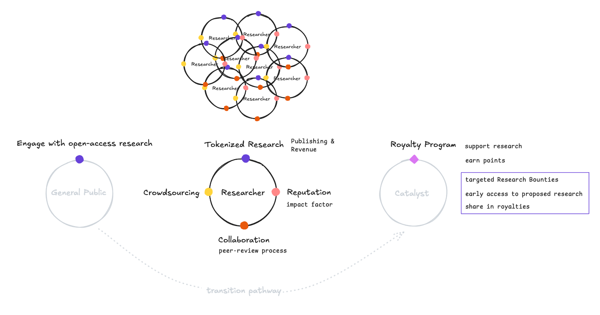

<!-- markdownlint-disable-->

# DeResHub

	

**DeResHub** is a research platform in the Solana ecosystem. It is built on two main pillars that drive innovation.

The first pillar focuses on creating mechanisms and tools to support high-quality research, help with founing, and build up researchers' reputations in the Solana community.

The second pillar adds an engagement layer that motivates researchers and participants. This includes a loyalty program where supporters can propose specific research topics. These supporters I called them catalyst are able to get early access to published research they proposed and can share in royalties.

**Our core principle is that all research must be published on-chain, and all the distributions are transparent.**

For the MVP for this capstone project, we will foucus on the research side first, especially tokenizing research. Here is how it works:

1. A researcher connects their wallet to create an account.
2. A researcher uploads their paper as a PDF.
3. The paper enters a pre-print stage for peer review.
4. After passing review, the researcher can decide whether to make it open access or charge a fee for use.
5. The researcher can publish the paper on-chain and mint a NFT, which will show up on DeResHub homepage.

[Persona and User Story](persona_usr_story.md)

## Features

## Architecture

## How to use
